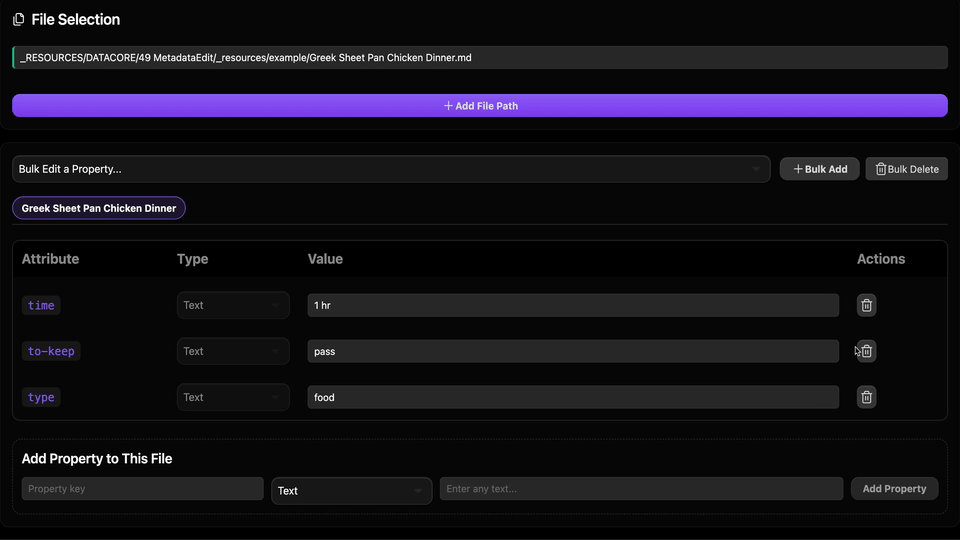

  
  
  <h1 align="center">METADATA EDIT</h1>
  <h3 align="center"> Mᴜʟᴛɪ-Fɪʟᴇ Fʀᴏɴᴛᴍ2ᴛᴛᴇʀ ᴀɴᴅ YAML Pʀᴏᴘᴇʀᴛʏ Eᴅɪᴛᴏʀ </h3>

  <!-- TOP PURPLE LINKS -->
  
  
  
   
  <!-- BOTTOM GOLD TAXONOMY -->
  
  
  
  

<i>A comprehensive multi-file frontmatter editor inside Obsidian workspace leaves, featuring type-aware UI inputs and bulk editing operations (Bulk Add, Bulk Edit, Bulk Delete).</i>

The Metadata Edit component provides an IDE-like workspace environment for managing markdown frontmatter properties. It allows developers to load multiple vault files, inspect their properties side-by-side using tabs, perform type-aware inline value edits (arrays, booleans, numbers, dates, times, strings), and execute bulk actions across all selected files.

## Features

- **📂 Multi-File Load & Tabs**: Load multiple Markdown notes simultaneously and switch between their frontmatter views using a tabbed interface.
- **🏷️ Type-Aware Editing Controls**: Automatically detects property value types to render specialized inputs (nested list managers, calendars, checkboxes, number scrollboards).
- **⚡ Code Hot-Reloading**: Incorporates an event-driven code watcher in `index.jsx` which detects modifications to source code files and instantly reloads the view without polling.
- **🛠️ Bulk Attribute Operations**:
  - **Bulk Edit**: Select any key across active files and update its value universally.
  - **Bulk Add**: Append a new key-value property configuration across all loaded files.
  - **Bulk Delete**: Strip an unwanted metadata attribute from all files with one-click confirmation.
- **🤖 MCP Sync Bridge**: Continually synchronizes editor states with `data/mcp_state.json` and listens to forced reload signals in `data/mcp_commands.json`.

## Directory Index & Components

The package exposes the following compiled files:

| File | Description |
| :--- | :--- |
| **[METADATA EDIT.md](METADATA EDIT.md)** | Main entry point note designed to load in the Obsidian workspace leaf. |
| **[src/index.jsx](src/index.jsx)** | Main entry bootstrapper coordinating code modification auto-reloads. |
| **[src/App.jsx](src/App.jsx)** | Coordinator component managing local properties and FullTab layouts. |
| **[src/components/FilePanel.jsx](src/components/FilePanel.jsx)** | Left selection panel controlling note paths and validations. |
| **[src/components/EditorPanel.jsx](src/components/EditorPanel.jsx)** | Main grid table handling inline property fields and single value modifications. |
| **[src/components/BulkOperations.jsx](src/components/BulkOperations.jsx)** | Toolbar and modals executing bulk additions, edits, and deletions. |
| **[src/components/MCPBridge.jsx](src/components/MCPBridge.jsx)** | Synchronizer module writing status reports to `mcp_state.json`. |
| **[src/utils/domUtils.js](src/utils/domUtils.js)** | DOM helper utilities supporting portal sibling mounting. |
| **[data/example/](data/example/)** | Standard data folder containing the example recipe note (`Greek Sheet Pan Chicken Dinner.md`). |
| **[METADATA.md](METADATA.md)** | Packaging manifest outlining indexing, target, and security configurations. |
| **[CONTRIBUTION.md](CONTRIBUTION.md)** | Contributor architecture standards and local compilation guidelines. |
| **[LICENSE.md](LICENSE.md)** | MIT open-source license. |

## Contributors
- beto.group
